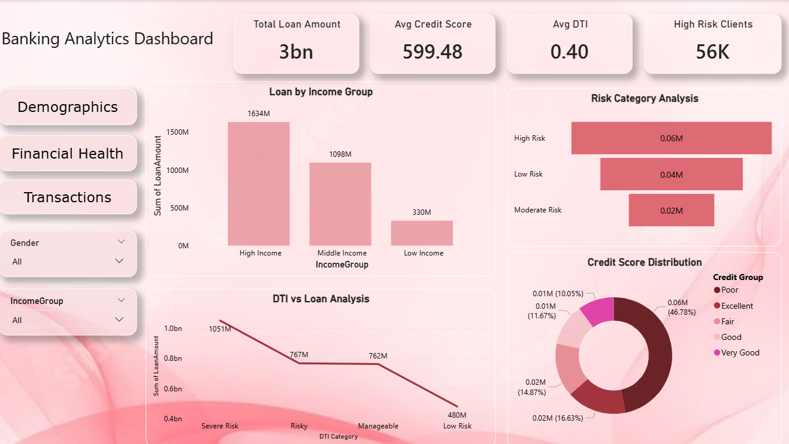
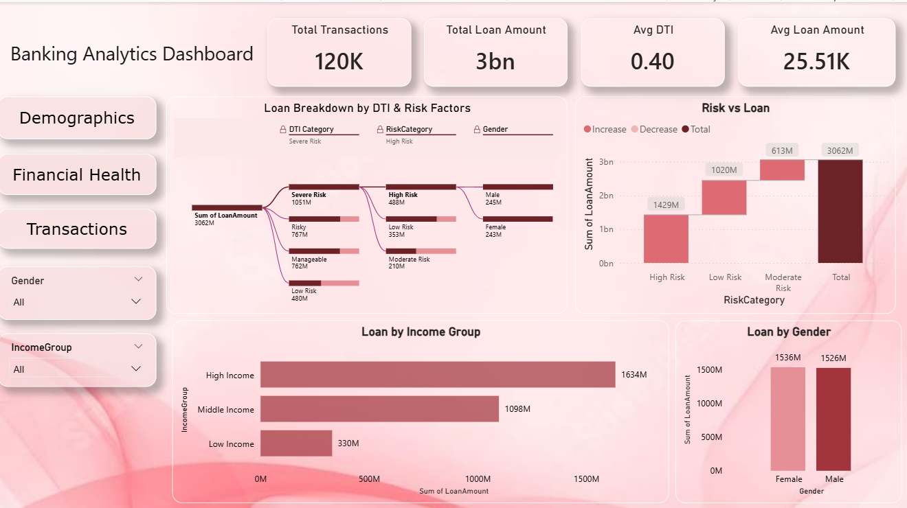

# 📊 Banking Analytics Dashboard

## 🚀 Project Story

Banks deal with thousands of customers every day, but understanding who the customers are, how financially healthy they are, and where the risks lie is not always easy.

This project was built to solve that problem.

The goal was to transform raw banking data into a clear, interactive dashboard that helps stakeholders:

* Understand customer demographics
* Evaluate financial health
* Identify risk patterns
* Analyze loan distribution

## 🎯 Problem Statement

Financial institutions need better visibility into:

* Which customers contribute most to revenue
* Which segments carry higher risk
* How income, credit score, and DTI impact loan behavior

Without proper visualization, these insights remain hidden in data.

## 💡 Solution

I designed a **3-page Power BI dashboard** that converts raw data into meaningful insights:

* Clean and interactive UI
* Dynamic filtering using slicers
* Easy navigation across pages
* Advanced visuals like Decomposition Tree

This allows users to explore data intuitively and make better decisions.

## 📊 Dashboard Pages

### 📌 Demographics Dashboard

This page answers: *Who are our customers?*

* Total clients, average income, and age
* Age group distribution by gender
* Income segmentation
* Credit score grouping

### 💰 Financial Health Dashboard

This page answers: *How financially stable are our customers?*

* Total loan amount and average credit score
* Loan distribution across income groups
* Risk category breakdown
* DTI-based financial insights

### 💳 Transactions Dashboard

This page answers: *Where is the money flowing and what drives it?*

* Total transactions and loan metrics
* Risk vs loan comparison
* Income-based loan distribution
* Decomposition Tree for deep analysis

## 🧠 Key Business Insights

* High-income customers contribute the largest share of total loan amount
* Moderate-risk customers form the majority segment
* Debt-to-Income (DTI) ratio significantly impacts loan approval and size
* Risk segmentation helps identify potential high-risk customers early

## 🛠️ Tools & Technologies

* Power BI
* DAX (Data Analysis Expressions)
* CSV Dataset

## ⚙️ Features

* Interactive multi-page dashboard
* Page navigation using buttons
* Synced slicers across all pages
* KPI cards for quick insights
* Decomposition Tree for root cause analysis
* Clean and modern UI design

## 📂 Project Files

* Banking_Analytics_Dashboard.pbix → Power BI dashboard
* banking_dataset.csv → Dataset used
* Images → Dashboard previews

## 💡 What I Learned

* How to design business-focused dashboards
* Creating calculated columns and measures using DAX
* Building interactive and user-friendly reports
* Turning raw data into actionable insights

## 👤 Author

**Shruti Upadhyay**

Feel free to ⭐ the repository and connect with me!
